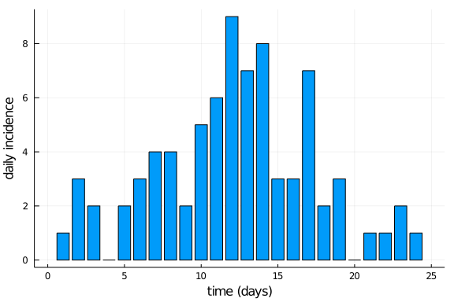

# SIR CTMC inference example

Andrew Black, 9/06/2020

This is an example of how to run the inference. More details of the algorithm
will be given somewhere else, but the main idea can be found in the paper [Computation of epidemic final size distributions.
J. Theor. Biol., 367, 159-165](https://dx.doi.org/10.1016/j.jtbi.2014.11.029)
and involves calculating the likelihood by solving the forward equation for the process. 

We then use the the AdvancedMH package to do the MCMC. 

~~~~{.julia}
using Random, Distributions
using AdvancedMH, MCMCChains
using Plots, StatsBase, StatsPlots
include("SIR_noQ.jl");
~~~~~~~~~~~~~

Simulate some test data
~~~~{.julia}
Random.seed!(7)
N = 100
data = SIR_sim(N,2.0/3,1/3)

Z1_obs = data[1][1:end-5] # truncate after last obs.
Z2_obs = data[2][3:end]   # truncate until first obs.
plot(data[1], label = "infections", legend=:bottomright)
plot!(data[2],label = "recoveries")
xlabel!("time (days)")
ylabel!("cumulative number of events")
~~~~~~~~~~~~~

\ 

This version uses the number of infection events on each day.

\ 

## Using the exact likelihood

Setup the likelihood function and proposal distribution. 
The covariance matrix was determined from a pilot run

~~~~{.julia}
function density(theta)
    if  theta[1] < 0 || theta[2] < 0
        return -Inf
    else
        return likelihood_tight(theta[1]/theta[2],1/theta[2],Z1_obs,N)
    end
end

C = [ 0.130982  0.190005; 0.190005  1.0076]
rw_prop = RWMH(MvNormal(0.5*C))
model = DensityModel(density)
chain = sample(model, rw_prop, 10^4; param_names=["R0", "1/\\gamma"], chain_type=Chains, init_params=[2.5,2.0]);
plot(chain)
~~~~~~~~~~~~~

\ 

## Using importance sampling

A faster method uses a particle filter, with importance sampling designed so that simulations
always match the observations. This is described in [Black, 2019](https://dx.doi.org/10.1007/s11222-018-9827-1).
Notice how we can get away with using many less particles. 

~~~~{.julia}
include("SIR_IS.jl")
daily_counts = diff([1;Z1_obs]) # careful not to count initial case. 
function density(theta)
    if  theta[1] < 0 || theta[2] < 0
        return -Inf
    else
        return SIR_likelihood_is(N,theta[1]/theta[2],1/theta[2],daily_counts,10)
    end
end

C = [ 0.130982  0.190005; 0.190005  1.0076]
rw_prop = RWMH(MvNormal(0.5*C))
model = DensityModel(density)
chain = sample(model, rw_prop, 10^4; param_names=["R0", "1/\\gamma"], chain_type=Chains, init_params=[2.5,2.0]);
plot(chain)
~~~~~~~~~~~~~

\ 

